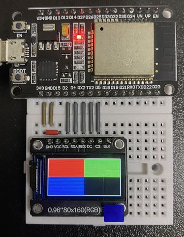
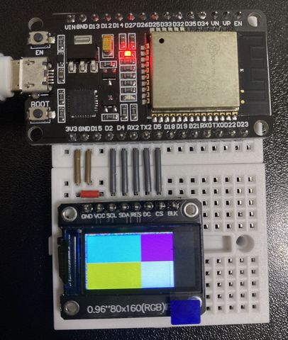

# ESP32_80x160_Arduino_GFX_examples

AliExpressでST7735ドライバの0.96インチTFT液晶を調達した際に、正しく動かないものが出てきた。

ライブラリのパラメータ変更ではどうにもならず、ネットを調べていたら、下記のフォーラムにあるように、ST7735のクローンとしてGC9106が乗っているものが出回っているようだった。

https://forum.arduino.cc/t/cropped-80x160-display-st7735s-tft-espi/899248

外見からは搭載しているドライバの判断がつかないため、ST7735で動かないときは、GC9106を試してみると幸せになれるかも。

なお、ST7735として動かす場合は、下記のコメント箇所を入れ替えてください。

    // Arduino_GFX *gfx = new Arduino_ST7735(bus, DISP_RES, 3, true, 80, 160, 26, 1, 26, 1);
    Arduino_GFX *gfx = new Arduino_GC9106(bus, DISP_RES, 1);

配線は、下記を想定。

ST7735ドライバを指定した時の表示が下記であった場合は、試す価値ありかと。

